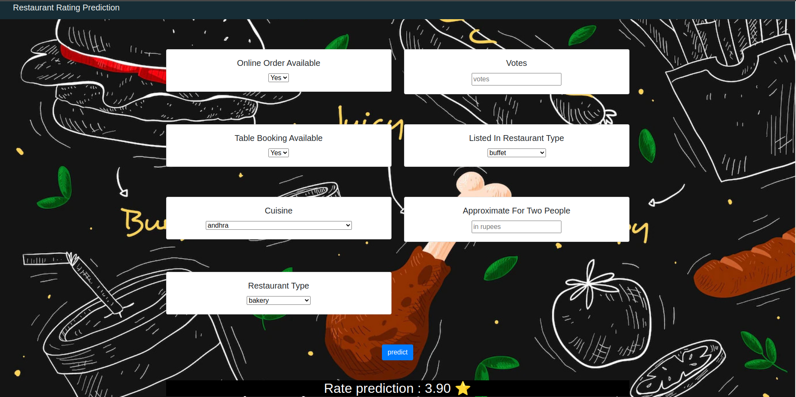

<h1 align="center">Zomato Restaurant Rating Prediction | iNeuron Internship</h1>

    </a> 
 

## Objective 🎯

Build a solution that should able to predict the ratings of the
restaurants based on some features that listed in the dataset.

## Poblem Statement ❓

The main goal of this project is to perform extensive Exploratory Data Analysis(EDA) on
the Zomato Dataset and build an appropriate Machine Learning Model that will help
various Zomato Restaurants to predict their respective Ratings based on certain features

## Dataset 

https://www.kaggle.com/datasets/himanshupoddar/zomato-bangalore-restaurants

## Technology 
Machine Learning Technology

## Domain 
E-commerce

## Programming Language 
Python

## Tools and Libraries 🛠
Jupyter NoteBook, VsCode, Pandas, Matplotlib, Seaborn, Sklearn, Flask, Heroku

## Conclusion 
- In Banglore 60% of restaurants are accepts online orders and Nearly 40% of the restaurants do not accept online orders

- Almost 90% restaurants in Banglore do not provide table booking facility.

- Almost more than 50 percent of restaurants has rating between 3 and 4

- In bangalore 90% of restaurants serve food for budget less than 1000 INR

- The Restaurants accepting online orders tend to get more votes from customers 

- BTM,HSR and Koranmangala 5th block has the most number of restaurants In Bangalore

- In Bangalore North Indian, chinese, South Indian and Biriyani cuisines are most common

- There is a strong relationships b\w Table booking service and rating of a resturant as well as Table booking service and cost

- Most of the resturants in Bangalore are casual dining and cafe

- Most of the casual dining and quick bites having rating mean between 3.2 and 4.0 

- approximate cost for two people in casual dining is around 600-90 INR in Bangalore

- approximate cost for two people in cafe is around 500-80 INR in Bangalore

- Most Famous Restaurant in Bangalore are 
  1. Cafe Coffee Day
  2. Onesta
  3. Empire Restaurant
  4. Kanti Sweets
  5. Five Star Chicken
  
### Zomato Restaurant rate prediction 🤖
  - For prediction I have used **Extra Tree Regression Model** 
  - It performed very well among other models 
  
  #### Training r2_score :- 0.9735
  #### Testing r2_score  :- 0.8498
 
## Deployment 🔗
- Web-application is deployed in Heroku

link :- https://rest-rating-prediction.herokuapp.com/

 

 
 <!-- line breaker -->

 <a href="https://www.linkedin.com/in/adil-rahman-80b17a23a/"  >connect with me</a>  
   

